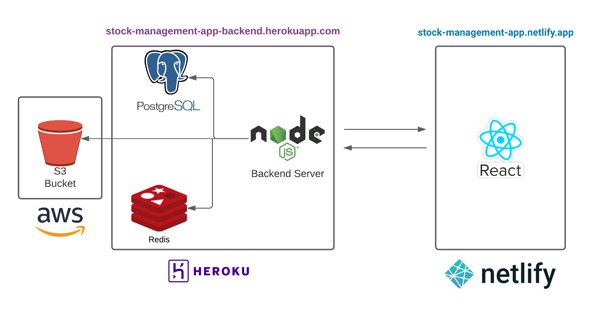
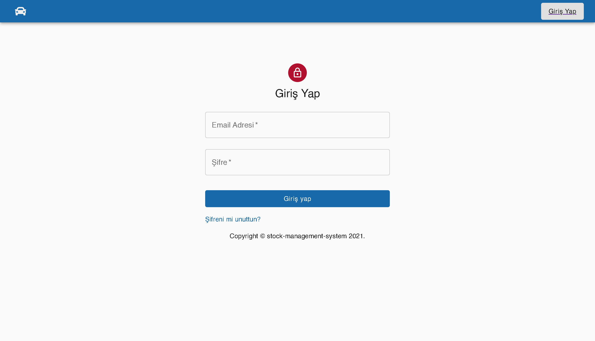
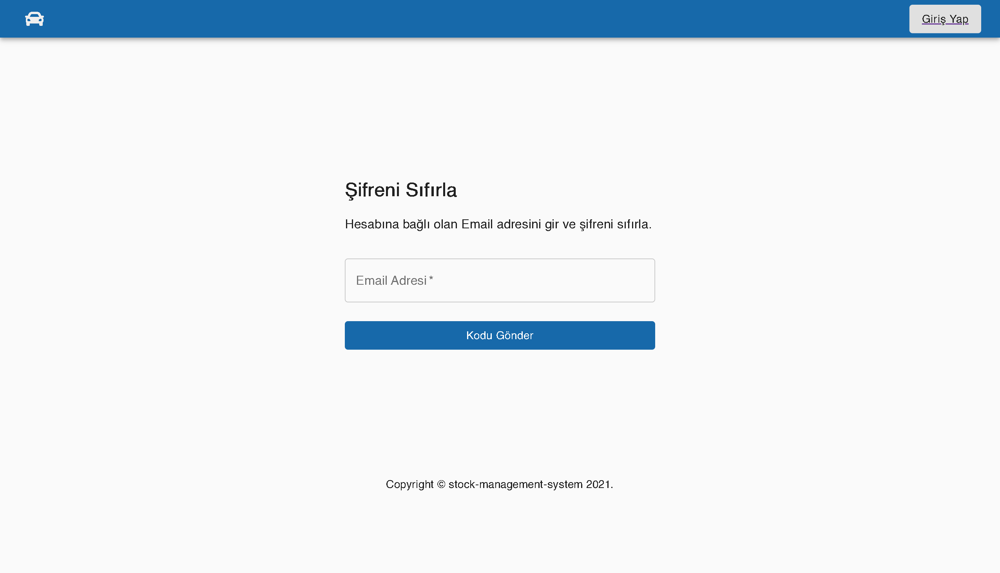
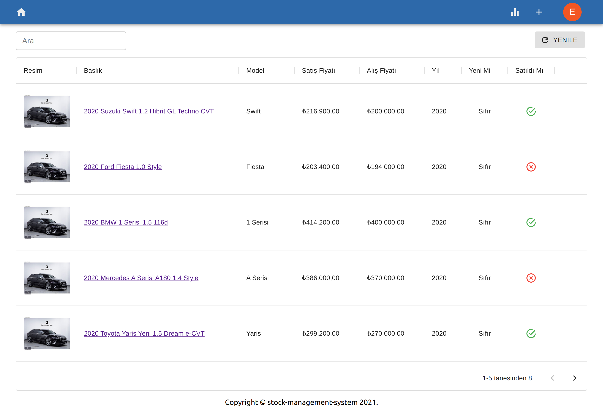
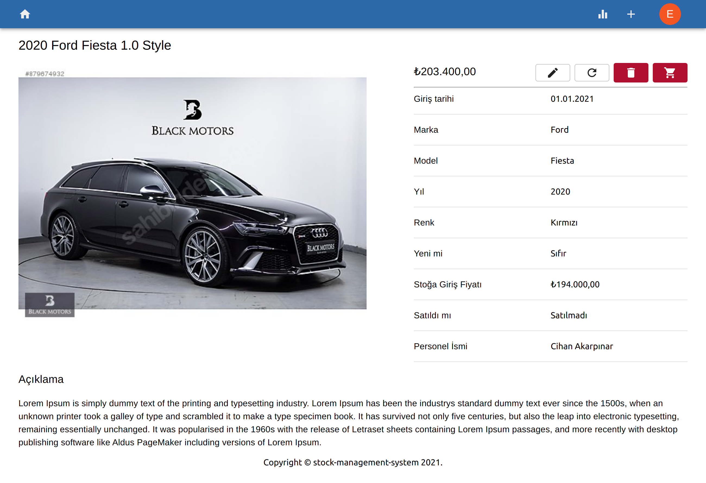
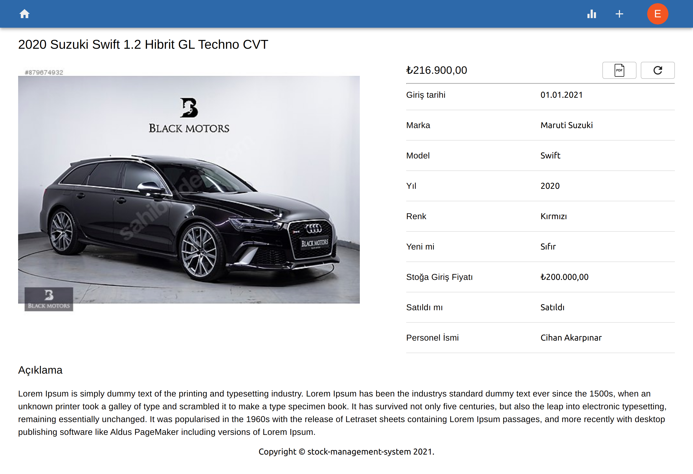
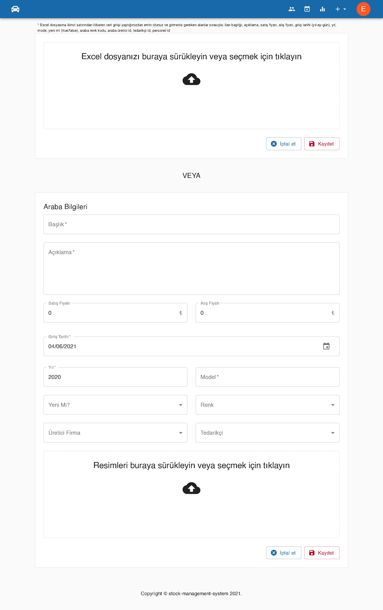
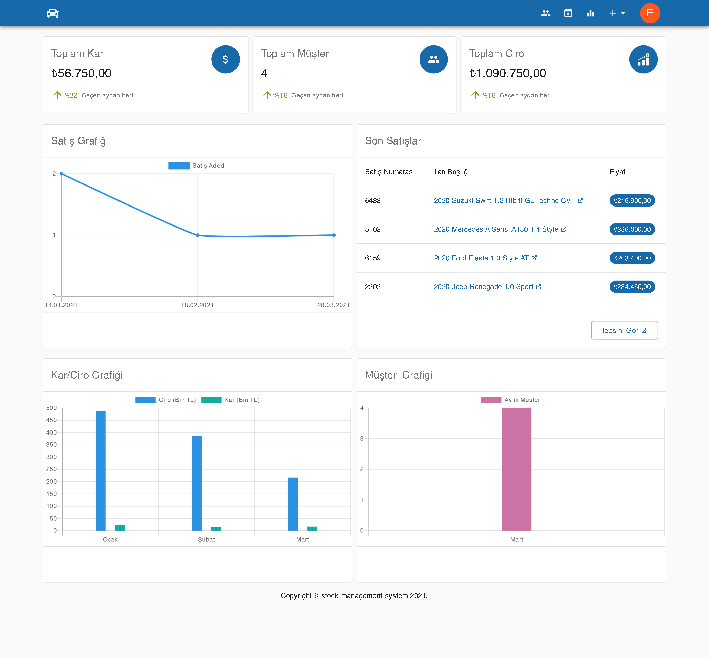
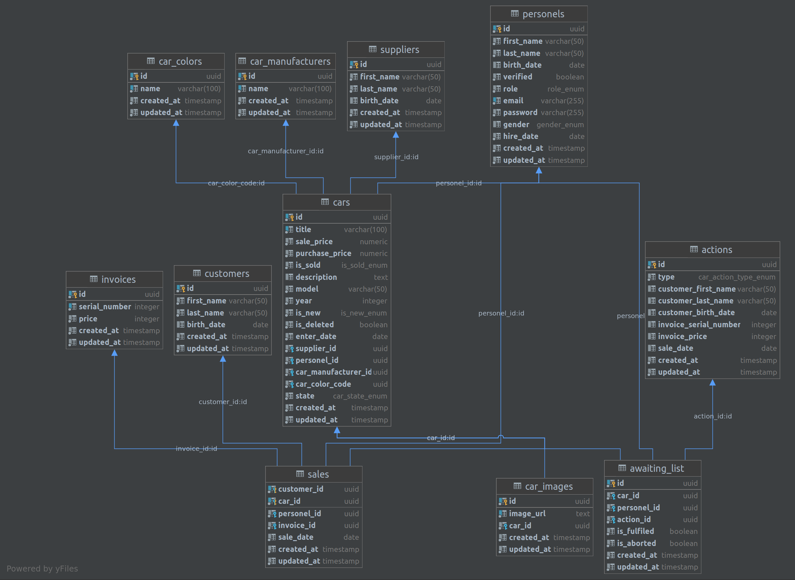

[](https://github.com/tterb/atomic-design-ui/blob/master/LICENSEs)

## Stock Management

Stock Management is an open-source full-stack project that can handle personel registration, car stock management operations and so on. I built this app using Node.js, React, Express, Postgres. You can access the live demo [here](https://stock-management-app.netlify.app)

if you want to check out client repository you can access it [here](https://github.com/emreturgutce/stock-management-client)

### Project Architecture

<p align="center">
    
</p>

### Images

#### Login

<p align="center">
    
</p>

#### Forgot Password

<p align="center">
    
</p>

#### Home

<p align="center">
    
</p>

#### Unsold Car Detail

<p align="center">
    
</p>

#### Sold Car Detail

<p align="center">
    
</p>

#### Car Add

<p align="center">
    
</p>

#### Daily Sales Chart

<p align="center">
    
</p>

#### Profile

<p align="center">
    
</p>

### Database Design

<p align="center">
    
</p>

### Installation

#### Backend

```bash
    git clone https://github.com/emreturgutce/stock-management.git
```

```bash
    docker-compose up
```

#### Client

```bash
    git clone https://github.com/emreturgutce/stock-management-client.git
```

```bash
    yarn start
```
